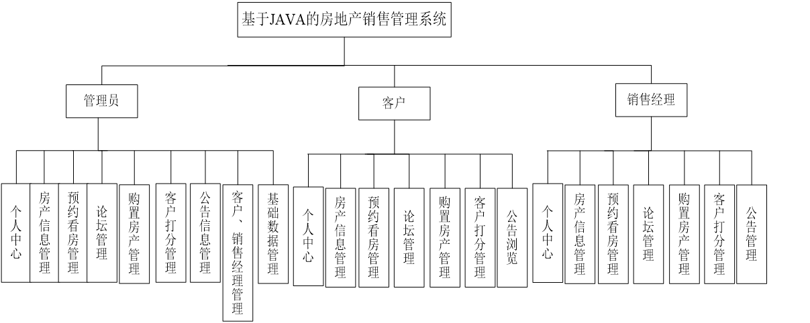
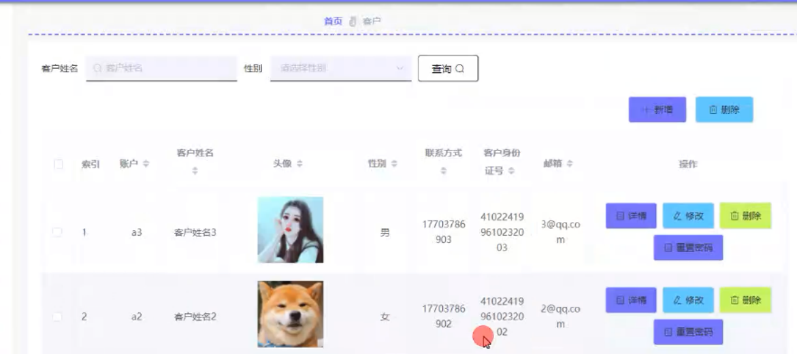
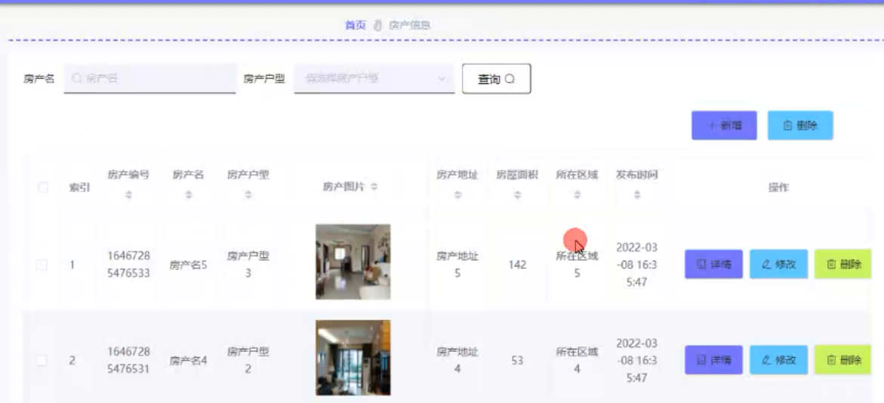
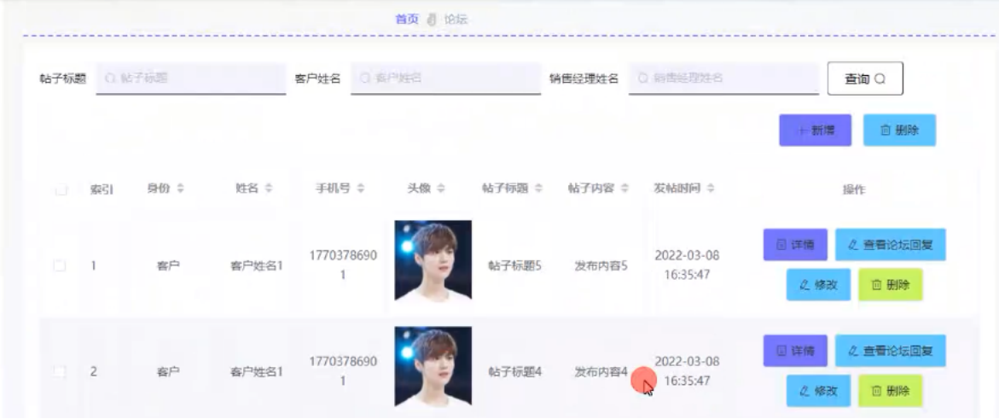
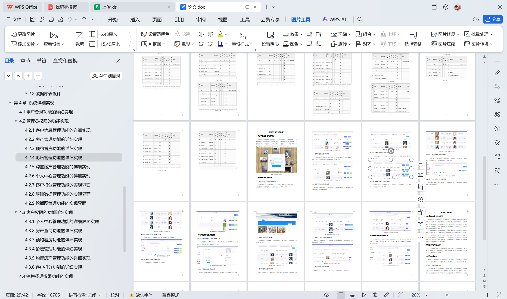

# springboot187-房地产销售管理系统的设计与实现

>  博主介绍：
>  Hey，我是程序员Chaers，一个专注于计算机领域的程序员
>  十年大厂程序员全栈开发‍ 日常分享项目经验 解决技术难题与技术推荐 承接各类网站设计，小程序开发，毕设等。
>  【计算机专业课程设计，毕业设计项目，Java，微信小程序，安卓APP都可以做，不仅仅是计算机专业，其它专业都可以】

## 3000套系统可挑选，获取链接：https://chaerspol.github.io/

<b>QQ【获取完整源码】：674456564</b>

<b>QQ群【获取完整源码】：1058861570</b>

### 系统架构

> 前端：html | js | css | jquery | vue
>
> 后端：springboot | mybatis
> 
> 环境：jdk1.8+ | mysql | maven

# 一、内容包括
包括有  项目源码+项目论文+数据库源码+答辩ppt+远程调试成功

# 二、运行环境

> jdk版本：1.8 及以上； ide工具：IDEA； 数据库: mysql5.7及以上；编程语言: Java

# 三、需求分析

**经济可行性分析**

系统开发所需要的经济主要在系统的成本问题、运行问题和维护问题上。本系统在开发中不需要经济的支撑，所需要的开发软件和设备都是在已有条件上。本系统在运行里所需要的环境也都为免费就可以下载的。本系统在后期的维护上也只需要技术支持就可以完成。所以本系统在经济可行性上可以通过。

**操作可行性分析**

本系统在开发中充分调查了所使用用户的操作习惯和风格，所有的操作流程也都为简单的流程，在操作中也设置了提醒。用户在使用本系统时只要按照提示就可以完成，非常简单。所以本系统在操作可行性上可以通过。

**技术可行性分析**

本系统所需要的技术支持为JAVA语言，Mysql数据库，Vue技术和B/s框架等。所使用的技术都为开源成熟的技术，也是目前流行的技术之一。使用这些技术开发的系统可以保证系统的前詹性和稳定性、安全性。所以本系统在技术可性性上可以通过。

**系统需求分析**

目前计算机、网络技术已进入到各行各业。房产做为生活的重要组成部分更应身体力行，房地产销售里的所有工作都是围绕房产而展开，每套房的房产档案信息都非常多，如果采用传统的管理方式非常容易造成混乱，而且对于房产的信息查询非常不便。对于房产的管理工作需要额外的严谨，如果还是采用传统的房产管理方式对房地产销售、购买都做不到百分百的监管，工作步骤、内容也实现不了透明。所以非常需要新的管理方式出现。

# 四、功能模块

系统的功能结构是采用树形图来绘制功能设计。根据分析所得，本系统的功能设计为管理员、客户、销售经理三部分。管理员为房产管理、预约看房管理、论坛管理、购置房产管理、客户打分管理、公告信息管理、客户管理、销售经理管理等，客户的功能为查询房产，在线预约、购置房产、管理个人信息、打分信息等。客户可以注册进行登录。销售经理为审核客户的预约、管理购置房产信息、客户打分信息等。本基于JAVA的房地产销售管理系统的功能结构设计图如下图。

# 五、效果图展示【部分效果图】

图5-1用户登录实现界面【用户登录界面起到验证身份的作用，本界面采用风景图片背景进行设计。在用户登录界面里设置了程序的名称和用户、密码、客户注册的文本框。在文本框下是登录按钮。用户在信息输入完成后可以使用登录按钮进行相对应的操作，还加入了登录安全的简单文字提醒。用户登录功能的实现界面如下图】

图5-2管理员查询客户信息的实现界面【管理员负责客户信息的录入和管理，客户的地址、联系方式等都可以由管理员在此功能里看到。管理员查询客户信息的功能实现如下图】

图5-3管理员查询房产信息的实现界面【管理员可以对房产的信息进行管理、审核。本功能可以实现房产的定时更新和审核管理。管理员查询房产信息的实现界面如下图】

图5-4预约看房查询功能的实现界面【    本功能包括查询已有的所有预约看房信息和删除预约看房信息。预约看房查询功能的实现详情如下图】

图5-5论坛管理功能的实现界面【管理员可以查询论坛和审核管理客户发布的帖子。论坛管理功能的实现界面如下图】

 <b>完整文章</b>
 
 
 

## 3000套系统可挑选，获取链接：https://chaerspol.github.io/

<b>QQ【获取完整源码】：674456564</b>

<b>QQ群【获取完整源码】：1058861570</b>

